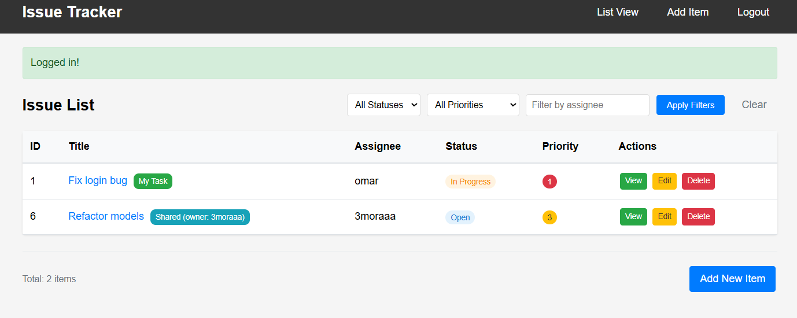
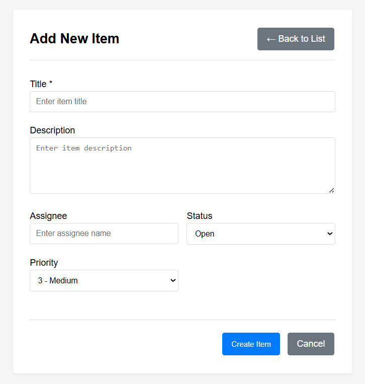
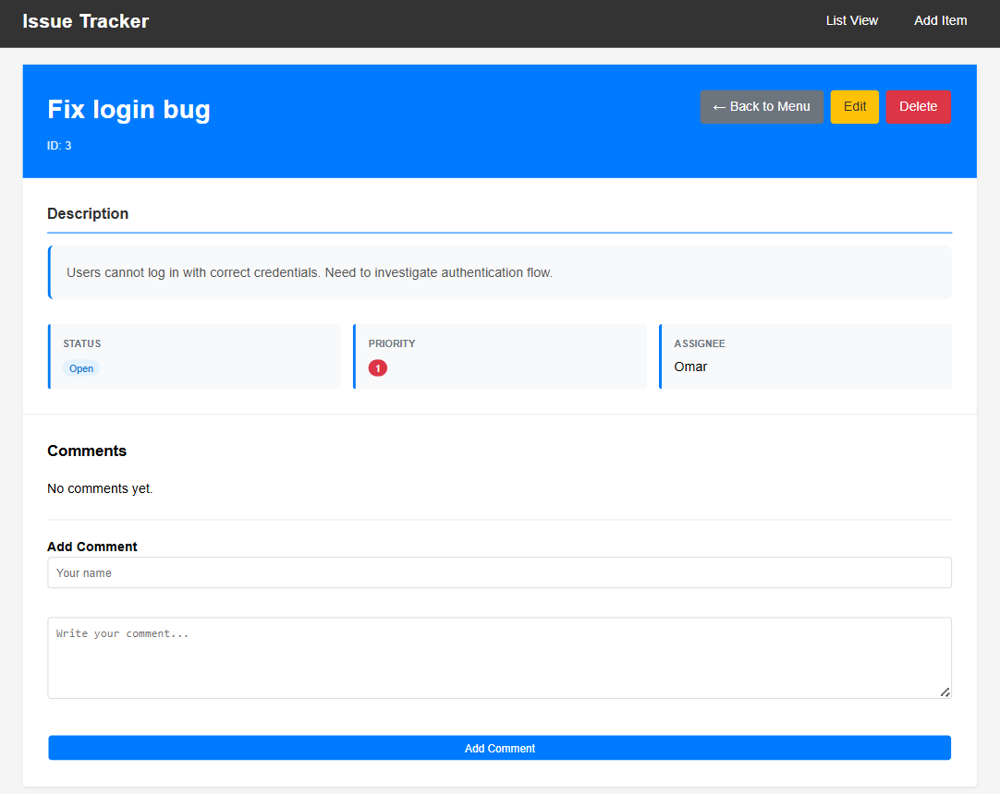

# Issue Tracker

A lightweight web application for tracking issues and tasks, built with **Flask** and **SQLite**.  
Designed for individuals and small teams who need a simple way to manage tasks and track progress.

---

## Features
- Create, edit, view, and delete items
- Filter and sort by status, priority, and assignee
- Color-coded priority labels (high / medium / low)
- Comment system for item discussions
- Clean table view with automatic ordering (status → priority)
- SQLite database for persistence

---

## Screenshots

### Home (Issues List)


### Add Item


### View Item Details


---

## Tech Stack
- **Backend**: Python (Flask)
- **Database**: SQLite3
- **Frontend**: HTML, CSS, Jinja2 templates

---

## Quick Start

### Prerequisites
- Python 3.7+
- pip (Python package manager)

### Installation
```bash
git clone https://github.com/OmarMashal0/issue-tracker.git
cd issue-tracker
pip install -r requirements.txt
python app.py
```

Visit: [http://127.0.0.1:5000](http://127.0.0.1:5000)

---

## Project Structure
```
issue-tracker/
├── app.py            # flask routes and application logic
├── db.py             # database functions
├── requirements.txt  # dependencies
├── static/
│   └── style.css     # css styling
├── templates/
│   ├── base.html     # shared layout
│   ├── list.html     # list view
│   ├── add.html      # add form
│   ├── edit.html     # edit form
│   └── view.html     # item details
├── screenshots/      # project screenshots
│   ├── home-issues.png
│   ├── add.png
│   └── view-task.png
└── README.md
```

---

## Database Schema

### Items
| Field       | Type | Description |
|-------------|------|-------------|
| id          | INT  | primary key |
| title       | TEXT | item title |
| description | TEXT | item description |
| status      | TEXT | Open / In Progress / Done |
| priority    | INT  | 1=High, 3=Medium, 5=Low |
| assignee    | TEXT | responsible person |

### Notes
| Field     | Type     | Description |
|-----------|----------|-------------|
| id        | INT      | primary key |
| item_id   | INT      | reference to item |
| author    | TEXT     | note author |
| content   | TEXT     | note content |
| timestamp | DATETIME | created time |

---

## License
This project is open source and available under the [MIT License](LICENSE).
