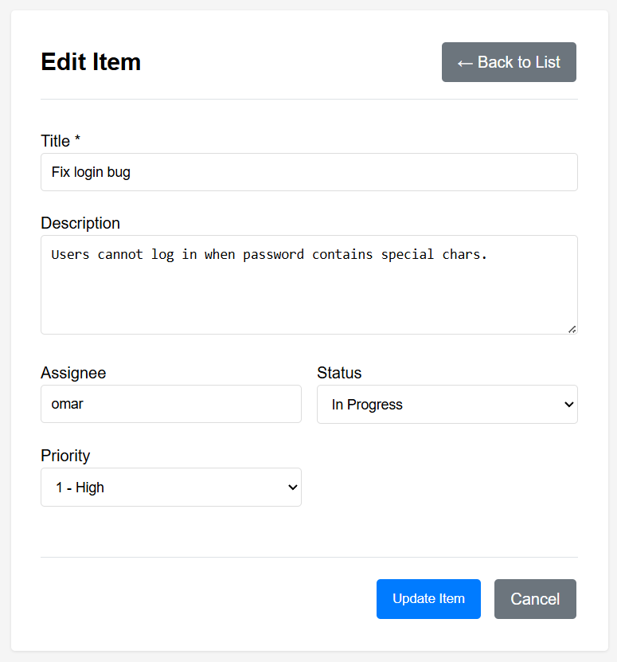
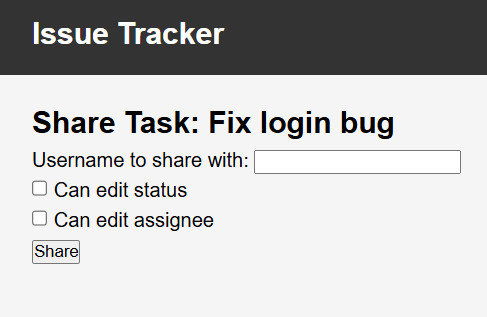
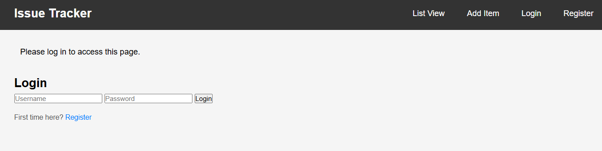

# Issue Tracker

A lightweight, full-featured web application for tracking issues and tasks, built with **Flask** and **SQLite**.  
Designed for individuals and small teams who need a simple way to manage tasks, collaborate, and track progress.

---

## 🚀 Features
- **Authentication System**
  - Register new users with secure password hashing (bcrypt)
  - Login / Logout functionality with session management
- **Task Management**
  - Create, edit, view, and delete tasks
  - Assign tasks to specific users
  - Filter and sort tasks by **status**, **priority**, or **assignee**
  - Owner and Shared task distinction with badges
- **Permissions & Sharing**
  - Share tasks with other users by username
  - Grant fine-grained permissions:
    - Can edit status ✅
    - Can edit assignee ✅
  - Owners can revoke (unshare) access anytime
- **Comments**
  - Add comments to tasks for discussions
  - Timestamps and author details included
- **UI Enhancements**
  - Color-coded **status** and **priority** labels
  - Responsive design with clean table & detail views
  - Flash messages for user feedback

---

## 📸 Screenshots

### Home (Issues List)


### Add Item


### Edit Item


### View Task


### Share Task


### Login


---

## 🛠 Tech Stack
- **Backend**: Python (Flask, Flask-Login, Flask-RESTful)
- **Database**: SQLite3, easily extendable to PostgreSQL (Soon in the Next Version!)
- **Frontend**: HTML, CSS, Jinja2 templates
- **Containerization**: Docker & Docker Compose

---

## ⚡ Quick Start

### Prerequisites
- Python 3.7+
- pip (Python package manager)

### Installation
```bash
git clone https://github.com/OmarMashal0/issue-tracker.git
cd issue-tracker
pip install -r requirements.txt
python app.py
```

Visit: [http://127.0.0.1:5000](http://127.0.0.1:5000)

---

## 📂 Project Structure
```
issue-tracker/
├── app.py                # Flask routes and application logic
├── db.py                 # Database models & helper functions
├── api.py                # RESTful API endpoints
├── requirements.txt      # Dependencies
├── Dockerfile            # Docker configuration
├── docker-compose.yml    # Docker Compose config
├── items.db              # Preloaded database (for demo)
├── static/
│   └── style.css         # CSS styling
├── templates/
│   ├── base.html         # Shared layout
│   ├── list.html         # List view
│   ├── add.html          # Add form
│   ├── edit.html         # Edit form (with permissions)
│   ├── view.html         # Item details + comments + sharing
│   ├── login.html        # Login page
│   ├── register.html     # Register page
│   └── share.html        # Share task form
├── screenshots/          # Project screenshots
│   ├── home-issues.png
│   ├── add.png
│   ├── edit.png
│   ├── view-task.png
│   ├── share.png
│   └── login.png
└── README.md

```

---

## 🗄 Database Schema

### Users
| Field   | Type | Description |
|---------|------|-------------|
| id      | INT  | Primary key |
| username| TEXT | Unique username |
| password| TEXT | Hashed password |
| role    | TEXT | Default "user" |

### Items (Tasks)
| Field       | Type | Description |
|-------------|------|-------------|
| id          | INT  | Primary key |
| title       | TEXT | Task title |
| description | TEXT | Task description |
| status      | TEXT | Open / In Progress / Done |
| priority    | INT  | 1=High → 5=Low |
| assignee    | TEXT | Responsible person |
| user_id     | INT  | Owner user ID |

### Notes (Comments)
| Field     | Type     | Description |
|-----------|----------|-------------|
| id        | INT      | Primary key |
| item_id   | INT      | Reference to task |
| author    | TEXT     | Comment author |
| content   | TEXT     | Comment body |
| timestamp | DATETIME | Created time |

### Task Shares
| Field            | Type | Description |
|------------------|------|-------------|
| id               | INT  | Primary key |
| task_id          | INT  | Task being shared |
| user_id          | INT  | User with access |
| can_edit_status  | INT  | Permission flag |
| can_edit_assignee| INT  | Permission flag |

---

## 📦 Deployment (Optional)
You can run this app in Docker:

```bash
docker-compose up --build
```

App will run on [http://localhost:5000](http://localhost:5000)

---

## 📜 License
This project is open source and available under the [MIT License](LICENSE).
